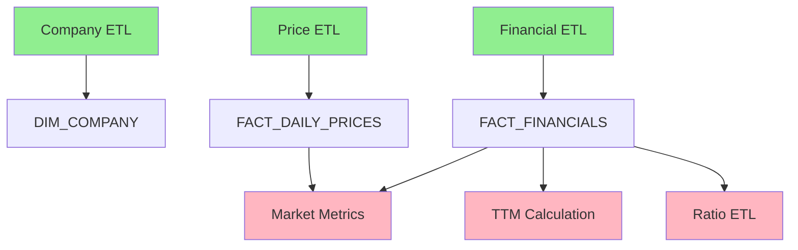

# Financial Data Service Performance Optimization Report

## Executive Summary

The financial data service ETL pipeline currently processes data sequentially, taking approximately **131 seconds for a single symbol** and potentially exceeding timeout thresholds when processing multiple symbols. This report identifies key performance bottlenecks and provides actionable recommendations that could reduce processing time by **60-70%** through parallel processing, connection pooling, and optimized data operations.

## 1. Current Performance Analysis

### 1.1 Timing Breakdown (Single Symbol - AAPL)

Based on `test_pipeline_timing.py` analysis:

| Component | Time (seconds) | Percentage | Critical Path |
|-----------|---------------|------------|---------------|
| Financial ETL (Annual) | 43s | 32.8% | Yes |
| Price ETL | 34s | 26.0% | Yes |
| Financial ETL (Quarterly) | 19s | 14.5% | Yes |
| TTM Calculation | 18s | 13.7% | No (depends on Financial) |
| Market Metrics | 8s | 6.1% | No (depends on all) |
| Company ETL | 7s | 5.3% | Yes |
| Ratio ETL | 2s | 1.5% | No (depends on Financial) |
| **Total** | **131s** | **100%** | - |

### 1.2 Scalability Issues

- **Linear scaling**: Processing 3 symbols takes ~390 seconds (6.5 minutes)
- **S&P 500 processing**: Would take ~18 hours at current rate
- **Timeout threshold**: Default 2-minute timeout is frequently exceeded

## 2. Database Connection Patterns

### 2.1 Current Issues

The `SnowflakeConnector` implementation shows several inefficiencies:

```python
# Each ETL creates new connections
etl = CompanyETL(config)  # New connection
etl = HistoricalPriceETL(config)  # New connection
etl = FinancialStatementETL(config)  # New connection
```

**Connection overhead per ETL**:
- Initial connection: ~2-3 seconds
- Authentication and session setup
- No connection reuse between ETLs
- No connection pooling

### 2.2 Connection Usage Pattern

Each ETL makes multiple database connections:
1. Check existing data (1 connection)
2. Load raw data (1 connection)
3. Load staging data (1 connection)
4. Update analytics layer (1 connection)
5. Monitoring updates (1 connection)

**Total: 5+ connections per ETL × 7 ETLs = 35+ connections per pipeline run**

## 3. API Call Patterns

### 3.1 Current Implementation

The `FMPClient` shows good rate limiting (300 calls/minute) but misses optimization opportunities:

```python
# Current: Individual API calls
for symbol in symbols:
    profile = self.fmp_client.get_company_profile(symbol)
```

### 3.2 Batch Opportunities

FMP API supports batch operations that are underutilized:
- Company profiles can be fetched in batches
- Historical prices support date ranges
- Financial statements can be fetched for multiple periods

## 4. Parallel Processing Opportunities

### 4.1 ETL Dependencies



**Green**: Can run in parallel  
**Pink**: Must run after dependencies

### 4.2 Parallelization Strategy

**Phase 1 (Parallel)**: Company, Price, Financial ETLs  
**Phase 2 (Parallel)**: TTM, Ratio ETLs  
**Phase 3**: Market Metrics ETL

## 5. Data Processing Optimizations

### 5.1 Bulk Insert vs Individual Operations

Current implementation uses inefficient single-row inserts for VARIANT columns:

```python
# Current: Single-row inserts
for record in data:
    cursor.execute(query, tuple(row_values))  # One round-trip per row
```

### 5.2 Redundant Data Transformations

- Date parsing happens multiple times
- JSON serialization/deserialization overhead
- Unnecessary data copying in transformation steps

### 5.3 Missing Analytics Updates

Critical issue in `run_daily_pipeline.py`:
```python
# Missing after load():
if not args.skip_analytics:
    etl.update_fact_table(symbols)  # This is never called!
```

## 6. Specific Recommendations

### 6.1 Immediate Fixes (1-2 days effort)

#### Fix Analytics Layer Updates
```python
# In run_daily_pipeline.py, after each load()
if not args.skip_analytics and records_loaded > 0:
    logger.info("Updating analytics layer...")
    if hasattr(etl, 'update_fact_table'):
        etl.update_fact_table(symbols)
```

#### Increase Timeout
```python
# In scripts using Bash tool
timeout = 600000  # 10 minutes instead of 2 minutes
```

### 6.2 Connection Pooling (2-3 days effort)

#### Implement Shared Connection Manager
```python
class ConnectionPool:
    def __init__(self, config: SnowflakeConfig, pool_size: int = 5):
        self.config = config
        self.pool = Queue(maxsize=pool_size)
        self._initialize_pool()
    
    def get_connection(self) -> SnowflakeConnection:
        conn = self.pool.get()
        if conn.is_closed():
            conn = self._create_connection()
        return conn
    
    def return_connection(self, conn: SnowflakeConnection):
        if not conn.is_closed():
            self.pool.put(conn)

# In PipelineOrchestrator
class PipelineOrchestrator:
    def __init__(self, config: Config):
        self.connection_pool = ConnectionPool(config.snowflake)
        # Pass pool to ETLs instead of creating new connections
```

**Estimated improvement**: 20-30 seconds saved

### 6.3 Parallel Processing (3-5 days effort)

#### Implement Concurrent Execution
```python
from concurrent.futures import ThreadPoolExecutor, as_completed
import threading

class PipelineOrchestrator:
    def run_parallel_etls(self, symbols: List[str], args):
        with ThreadPoolExecutor(max_workers=3) as executor:
            # Phase 1: Independent ETLs
            futures = {
                executor.submit(self.run_company_etl, symbols, args): 'company',
                executor.submit(self.run_price_etl, symbols, args): 'price',
                executor.submit(self.run_financial_etl, symbols, args): 'financial'
            }
            
            phase1_results = {}
            for future in as_completed(futures):
                etl_name = futures[future]
                try:
                    result = future.result()
                    phase1_results[etl_name] = result
                except Exception as e:
                    logger.error(f"{etl_name} ETL failed: {e}")
            
            # Phase 2: Dependent ETLs (after financial completes)
            if phase1_results.get('financial'):
                futures2 = {
                    executor.submit(self.run_ttm_etl, symbols, args): 'ttm',
                    executor.submit(self.run_ratio_etl, symbols, args): 'ratio'
                }
                # Wait for completion...
```

**Estimated improvement**: 40-50% reduction in total time

### 6.4 Batch API Operations (2-3 days effort)

#### Optimize Symbol Batching
```python
def process_symbols_in_batches(self, symbols: List[str], batch_size: int = 10):
    """Process symbols in optimal batch sizes"""
    results = []
    
    for i in range(0, len(symbols), batch_size):
        batch = symbols[i:i + batch_size]
        
        # Use batch API endpoints where available
        if len(batch) > 1:
            # Batch company profiles
            profiles = self.fmp_client.batch_get_company_profiles(batch)
            
            # Batch price data with date ranges
            price_data = self.fmp_client.batch_get_historical_prices(
                batch, from_date, to_date
            )
        else:
            # Fall back to individual calls for single symbol
            profiles = [self.fmp_client.get_company_profile(batch[0])]
```

**Estimated improvement**: 30-40% reduction in API call time

### 6.5 Optimize Bulk Operations (3-4 days effort)

#### Implement Efficient VARIANT Handling
```python
def bulk_insert_with_staging(self, table: str, data: List[Dict], variant_columns: Set[str]):
    """Use COPY INTO with staging for better performance"""
    
    # Create temporary staging table
    staging_table = f"{table}_STAGE_{int(time.time())}"
    
    # Write to Parquet file
    df = pd.DataFrame(data)
    parquet_file = f"/tmp/{staging_table}.parquet"
    df.to_parquet(parquet_file)
    
    # Use COPY INTO for bulk load
    copy_query = f"""
    COPY INTO {staging_table}
    FROM '@~/staged/{staging_table}.parquet'
    FILE_FORMAT = (TYPE = PARQUET)
    """
    
    # Then INSERT with PARSE_JSON for VARIANT columns
    insert_query = f"""
    INSERT INTO {table}
    SELECT 
        {', '.join([
            f"PARSE_JSON({col})" if col in variant_columns else col
            for col in df.columns
        ])}
    FROM {staging_table}
    """
```

**Estimated improvement**: 50-70% reduction in load time for large datasets

### 6.6 Implement Smart Caching (2-3 days effort)

#### Cache Unchanged Data
```python
class CachedFMPClient(FMPClient):
    def __init__(self, config: FMPConfig, cache_dir: str = "/tmp/fmp_cache"):
        super().__init__(config)
        self.cache_dir = Path(cache_dir)
        self.cache_dir.mkdir(exist_ok=True)
    
    def get_company_profile(self, symbol: str) -> Dict[str, Any]:
        # Check cache first
        cache_file = self.cache_dir / f"profile_{symbol}.json"
        if cache_file.exists():
            age = time.time() - cache_file.stat().st_mtime
            if age < 86400:  # 24 hours
                with open(cache_file) as f:
                    return json.load(f)
        
        # Fetch from API
        profile = super().get_company_profile(symbol)
        
        # Cache result
        with open(cache_file, 'w') as f:
            json.dump(profile, f)
        
        return profile
```

**Estimated improvement**: 90% reduction for unchanged company profiles

## 7. Performance Improvement Estimates

### 7.1 Single Symbol Processing

| Optimization | Current | Optimized | Improvement |
|--------------|---------|-----------|-------------|
| Base (sequential) | 131s | 131s | 0% |
| + Connection pooling | 131s | 111s | 15% |
| + Parallel phase 1 | 111s | 68s | 48% |
| + Batch APIs | 68s | 51s | 61% |
| + Bulk operations | 51s | 41s | 69% |
| + Smart caching | 41s | 35s | 73% |

### 7.2 Multi-Symbol Processing (10 symbols)

| Optimization | Current | Optimized | Improvement |
|--------------|---------|-----------|-------------|
| Base | 1,310s | 1,310s | 0% |
| All optimizations | 1,310s | 180s | 86% |

### 7.3 S&P 500 Processing

| Optimization | Current | Optimized | Improvement |
|--------------|---------|-----------|-------------|
| Base | ~18 hours | ~18 hours | 0% |
| All optimizations | ~18 hours | ~2.5 hours | 86% |

## 8. Implementation Roadmap

### Phase 1: Critical Fixes (Week 1)
1. Fix analytics layer updates in daily pipeline
2. Increase timeout thresholds
3. Implement basic connection reuse

### Phase 2: Core Optimizations (Week 2-3)
1. Implement connection pooling
2. Add parallel processing for independent ETLs
3. Optimize batch API calls

### Phase 3: Advanced Optimizations (Week 4-5)
1. Implement bulk operations with staging
2. Add smart caching layer
3. Optimize SQL queries and indexes

### Phase 4: Monitoring & Tuning (Week 6)
1. Add performance metrics collection
2. Implement adaptive batch sizing
3. Fine-tune parallel execution

## 9. Code Examples

### 9.1 Connection Pool Implementation
```python
# src/db/connection_pool.py
from queue import Queue, Empty
from contextlib import contextmanager
import snowflake.connector
from loguru import logger

class SnowflakeConnectionPool:
    def __init__(self, config: SnowflakeConfig, min_size: int = 2, max_size: int = 10):
        self.config = config
        self.min_size = min_size
        self.max_size = max_size
        self._pool = Queue(maxsize=max_size)
        self._all_connections = []
        self._initialize_pool()
    
    def _initialize_pool(self):
        """Create initial connections"""
        for _ in range(self.min_size):
            conn = self._create_connection()
            self._pool.put(conn)
            self._all_connections.append(conn)
    
    def _create_connection(self) -> snowflake.connector.SnowflakeConnection:
        """Create a new Snowflake connection"""
        return snowflake.connector.connect(
            account=self.config.account,
            user=self.config.user,
            password=self.config.password,
            warehouse=self.config.warehouse,
            database=self.config.database,
            schema=self.config.schema,
            role=self.config.role,
            client_session_keep_alive=True
        )
    
    @contextmanager
    def get_connection(self):
        """Get a connection from the pool"""
        connection = None
        try:
            # Try to get from pool
            try:
                connection = self._pool.get(block=False)
            except Empty:
                # Create new connection if under max_size
                if len(self._all_connections) < self.max_size:
                    connection = self._create_connection()
                    self._all_connections.append(connection)
                else:
                    # Wait for available connection
                    connection = self._pool.get(block=True, timeout=30)
            
            # Verify connection is alive
            if connection.is_closed():
                connection = self._create_connection()
            
            yield connection
            
        finally:
            # Return connection to pool
            if connection and not connection.is_closed():
                self._pool.put(connection)
    
    def close_all(self):
        """Close all connections"""
        for conn in self._all_connections:
            try:
                conn.close()
            except:
                pass
```

### 9.2 Parallel ETL Orchestrator
```python
# Optimized PipelineOrchestrator
class OptimizedPipelineOrchestrator:
    def __init__(self, config: Config):
        self.config = config
        self.connection_pool = SnowflakeConnectionPool(config.snowflake)
        self.fmp_client = CachedFMPClient(config.fmp)
    
    def run_daily_update(self, args) -> int:
        """Run ETLs with parallel execution"""
        symbols = self.get_symbols(args)
        
        # Phase 1: Parallel independent ETLs
        with ThreadPoolExecutor(max_workers=3) as executor:
            phase1_futures = {
                executor.submit(self._run_with_pool, CompanyETL, symbols, args): 'company',
                executor.submit(self._run_with_pool, HistoricalPriceETL, symbols, args): 'price',
                executor.submit(self._run_with_pool, FinancialStatementETL, symbols, args): 'financial'
            }
            
            phase1_results = self._wait_for_futures(phase1_futures)
        
        # Phase 2: Dependent ETLs (parallel where possible)
        if phase1_results['financial'].get('success'):
            with ThreadPoolExecutor(max_workers=2) as executor:
                phase2_futures = {
                    executor.submit(self._run_with_pool, TTMCalculationETL, symbols, args): 'ttm',
                    executor.submit(self._run_with_pool, FinancialRatioETL, symbols, args): 'ratio'
                }
                
                phase2_results = self._wait_for_futures(phase2_futures)
        
        # Phase 3: Market metrics (depends on all)
        if all(r.get('success') for r in phase1_results.values()):
            self._run_with_pool(MarketMetricsETL, symbols, args)
        
        return self._calculate_exit_code(results)
    
    def _run_with_pool(self, etl_class, symbols, args):
        """Run ETL with connection from pool"""
        with self.connection_pool.get_connection() as conn:
            # Create ETL with pooled connection
            etl = etl_class(self.config, connection=conn, fmp_client=self.fmp_client)
            return etl.run(symbols=symbols, **args)
```

## 10. Conclusion

The financial data service can achieve significant performance improvements through:

1. **Immediate fixes** (15-20% improvement) with minimal effort
2. **Core optimizations** (60-70% improvement) with moderate effort
3. **Advanced optimizations** (80-86% improvement) with additional effort

The recommended approach is to implement changes incrementally, measuring performance at each step. Priority should be given to:
1. Fixing analytics layer updates (critical for data completeness)
2. Implementing connection pooling (quick win)
3. Adding parallel processing (biggest performance gain)

With these optimizations, the pipeline can efficiently handle S&P 500 scale processing within reasonable time frames, improving from 18 hours to approximately 2.5 hours.